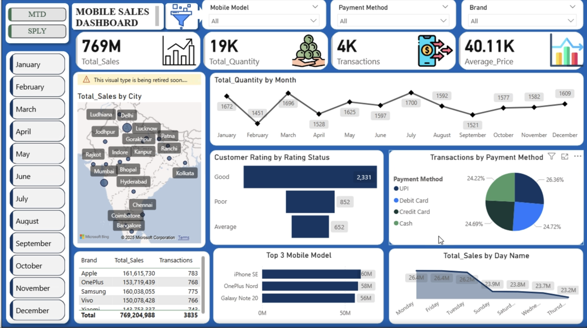
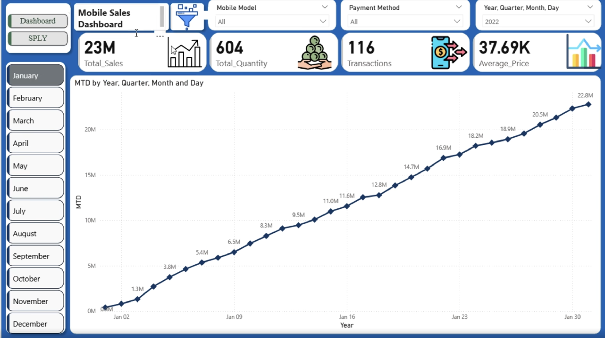
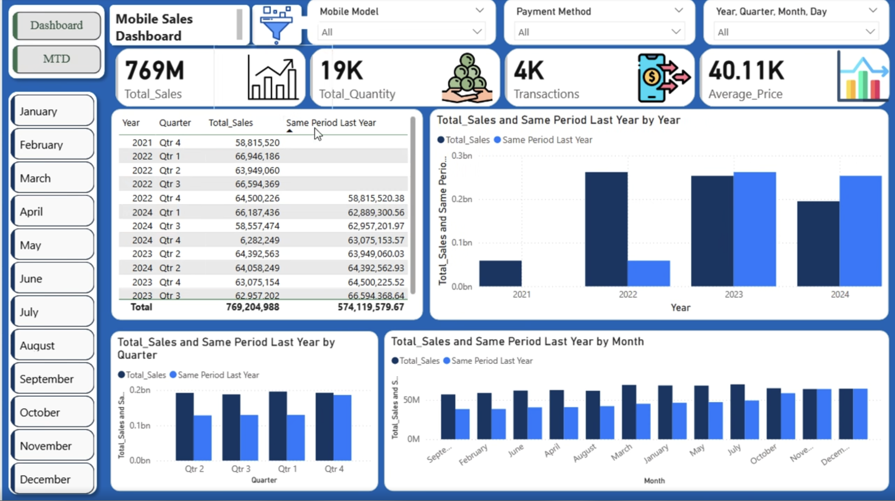

# 📱 Mobile Sales Performance Dashboard – Power BI

This repository contains an interactive **Power BI dashboard** designed to analyze **mobile phone sales**, identify **top-selling models**, and evaluate business performance using **DAX-based KPIs** such as **MTD (Month-to-Date)** and **SPLY (Same Period Last Year)**.

---

## 🚀 Project Overview

This dashboard provides end-to-end insights into mobile sales including:

➡ Model-wise sales performance  
➡ Which mobile model sold the most  
➡ Brand-wise revenue & quantity contribution  
➡ MTD vs SPLY performance comparison  
➡ Top 5 best-selling models using dynamic ranking  
➡ Sales trend visualization (Daily / Monthly)

The goal of this project is to demonstrate real-world **Business Intelligence**, **DAX modeling**, and **data storytelling** using Power BI.

---

## 🗂 Dataset Information

The dataset contains:

- Mobile Brand  
- Mobile Model  
- Sales Quantity  
- Sales Amount  
- Sales Date  
- Region / Store (optional)

Data was cleaned and transformed using **Power Query**.

---

## 🛠 Tools & Technologies Used

- **Power BI Desktop**
- **Power Query**
- **DAX (Data Analysis Expressions)**
- **Excel / CSV Dataset**
- **Data Modeling (Star Schema)**

---

## 📊 Dashboard Features

### ✔ Model-wise Sales
Shows which mobile model generated the highest sales and quantity.

### ✔ MTD (Month-to-Date) Performance
Tracks current month sales progress vs last month.

### ✔ SPLY (Same Period Last Year)
Compares current period sales to last year’s same date range.

### ✔ Top 3 Best-Selling Models
Automatically ranked using DAX.

### ✔ Trend Analysis
Daily / Monthly sales trends with filters.

---

## 🧮 DAX Measures Used

### 🔹 Total Sales
```DAX
Total Sales = SUM(Sales[Amount])
```

### 🔹 Total Quantity
```DAX
Total Qty = SUM(Sales[Quantity])
```

### 🔹 MTD Sales
```DAX
MTD Sales = 
CALCULATE(
    [Total Sales],
    DATESMTD('Date'[Date])
)
```

### 🔹 SPLY (Same Period Last Year)
```DAX
SPLY Sales = 
CALCULATE(
    [Total Sales],
    SAMEPERIODLASTYEAR('Date'[Date])
)
```

### 🔹 MTD Growth %
```DAX
MTD Growth % =
DIVIDE([MTD Sales] - [SPLY Sales], [SPLY Sales], 0)
```

### 🔹 Model Rank (Dynamic Ranking)
```DAX
Model Rank =
RANKX(
    ALL(Sales[Model]),
    [Total Qty],
    ,
    DESC
)
```

### 🔹 Top 3 Model Flag
```DAX
Top 5 Models =
IF([Model Rank] <= 3, "Top 3", "Others")
```

---

## 📁 Repository Structure

```
📂Sales-Dashboard
 ├── 📄 Mobile_Sales_Dashboard.pbix
 ├── 📄 sales_dataset.xlsx / csv
 ├── 📁 Images (screenshots of dashboard)
 └── 📄 README.md
```

---

## 📸 Dashboard Preview
(Add screenshots inside the **Images** folder and link them here.)

---

## ⭐ Conclusion

This project highlights:

- Real-world BI reporting  
- Data modeling using Power BI  
- Advanced DAX for KPIs  
- Industry-level dashboard design  

Feel free to ⭐ **star this repository** if you find it useful!

## 📸 Dashboard Preview

### 🔹 Main Dashboard Overview


### 🔹 Sales Trend Analysis


### 🔹 Same Period Last Year (SPLY) Comparison



Live Project - https://url-shortener.me/33IJ


